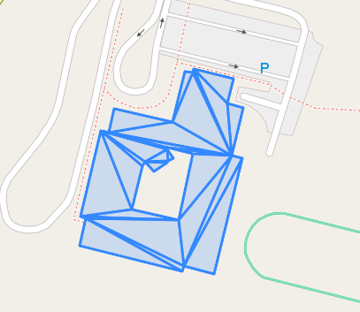
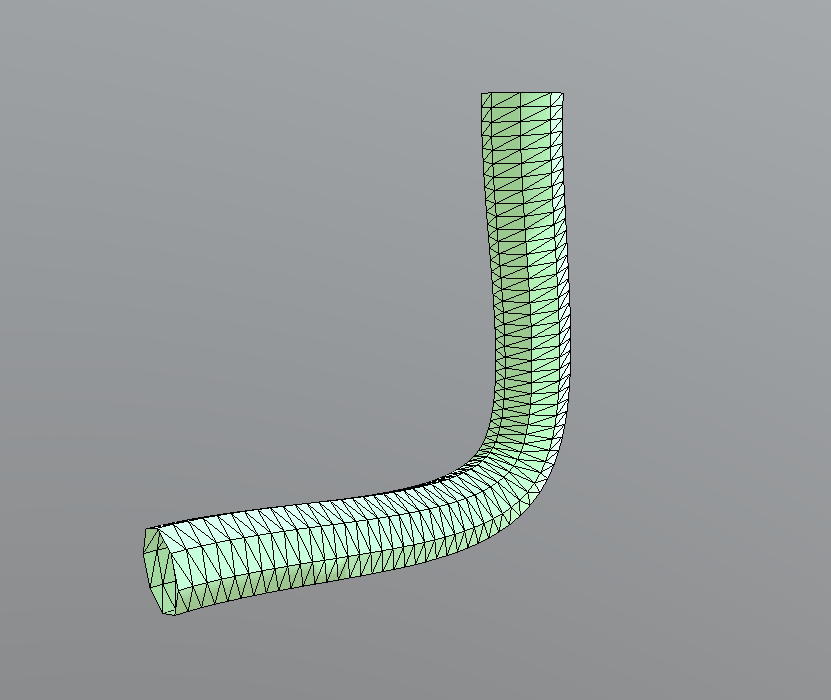

# Triangulator

.NET 6 library for triangulating 2D/3D WKB geometries (PolyhedralSurface/MultiPolygon/Polygon) using Earcut algorithm. Lines
can be triangulated using the TubeGeometry algorithm from Three.JS.

## NuGet

https://www.nuget.org/packages/bertt.triangulator/

## Sample code

```
var buildingWkb = File.ReadAllBytes(@"testdata/building.wkb");
var wkbTriangulated = Triangulator.Triangulate(buildingWkb);
var triangulatedGeometry = (PolyhedralSurface)Geometry.Deserialize<WkbSerializer>(wkbTriangulated);
Assert.IsTrue(triangulatedGeometry.Geometries.Count == 22);
```

## Sample result triangulating polyhedralsurface:

From: 

```
POLYHEDRALSURFACE Z (((0 0 0, 0 1 0, 1 1 0, 1 0 0, 0 0 0)),((0 0 0, 0 1 0, 0 1 1, 0 0 1, 0 0 0)), ((0 0 0, 1 0 0, 1 0 1, 0 0 1, 0 0 0)), ((1 1 1, 1 0 1, 0 0 1, 0 1 1, 1 1 1)),((1 1 1, 1 0 1, 1 0 0, 1 1 0, 1 1 1)),((1 1 1, 1 1 0, 0 1 0, 0 1 1, 1 1 1)))
```

To:

```
POLYHEDRALSURFACE Z (((0 0 0,0 1 0,1 0 0,0 0 0)),((1 1 0,1 0 0,0 1 0,1 1 0)),((0 0 1,0 0 0,0 1 0,0 0 1)),((0 1 0,0 1 1,0 0 1,0 1 0)),((0 0 1,0 0 0,1 0 0,0 0 1)),((1 0 0,1 0 1,0 0 1,1 0 0)),((1 1 1,1 0 1,0 1 1,1 1 1)),((0 0 1,0 1 1,1 0 1,0 0 1)),((1 1 0,1 1 1,1 0 1,1 1 0)),((1 0 1,1 0 0,1 1 0,1 0 1)),((1 1 1,1 1 0,0 1 1,1 1 1)),((0 1 0,0 1 1,1 1 0,0 1 0)))
```

Sample result triangulation with interior rings:



## Remarks

- Input wkb must be of type PolyhedralSurface/MultiPolygon/Polygon, otherwise an error will occur;
- Triangulated geometry is returned as WKB (as PolyhedralSurface/MultiPolygon);

## Polygons Method 

3D Triangulation is performed in 2D mode, by projecting each input polygon
to yz, zx or xy plane. The plane to project to is determined by the normal vector of the 
input polygon.

Pseudo code for calculating plane to project to (nb: using absolute normals here): 

```
yz: when (normal(x) > normal(y)) and (normal(x) > normal(z))
zx: else when (normal(y) > normal(z))
xy: all other cases
```

For triangulation the fast Earcut method is 
used. After triangulation the resulting triangles are 'unflattened' to get the 
3D triangles. 

After that, each triangle is checked to have the same direction as the original polygon by calculating
the dot product between the normal of the polygon and the normal of the triangle. If the dot 
product is negative, then the two vectors point in opposite directions and the triangle will be 
inverted.

## lines Method 

Triangles of (multi)lines can be calculate using the Triangulate method using the following parameters:

 - (Multi)LineString lineString: line geometry
 
 - float radius = 1
 
 - int tubularSegments = 64
 
 - int radialSegments = 8
 
 - bool closed = false

 A port of Three.JS TubeGeometry (https://github.com/hjoykim/THREE/) is used to calculate the triangles.
 
First a line is fitted through the points using the CatmullRomCurve3 (https://threejs.org/docs/#api/en/extras/curves/CatmullRomCurve3). 

After that the line is converted to a tube using the TubeGeometry (https://threejs.org/docs/?q=TubeGeometry#api/en/geometries/TubeGeometry).
 
The result is a MultiPolygon with the triangles.

Sample code: 


```
var wkt = "LINESTRING(-10 0 0,0 0 0,0 10 0)";
var line = (LineString)Geometry.Deserialize<WktSerializer>(wkt);
var triangles = Triangulator.Triangulate(line,2, 60, 8);
```

Sample result:




## Benchmark

todo

## Unit Testing

In the unit test there is an conversion method from triangles to glTF 2.0 using SharpGLTF (https://github.com/vpenades/SharpGLTF)
for visual inspections.

## Dependencies

wkx-sharp - https://github.com/cschwarz/wkx-sharp for handling geometries

## History

2024-02-20: release 1.4.3: fix lines of 2 points

2024-02-20: release 1.4.2: add multi-line support

2024-02-14: release 1.4.1: make tubularSegments and radialSegments optional

2024-02-14: release 1.4.0: add support for lines

2024-02-07: release 1.3.1: normals algorithm fix for higher precision

2024-02-07: release 1.3.0: add support for interior rings + polygons

2023-09-26: release 1.2.3: fix normal close to 0

2023-09-22: release 1.2.2: fix normals calculation

2023-08-30: release 1.2.1: add support for Geometry type as input (in addition of WKB)

2023-08-30: release 1.2: add support for MultiPolygon

2020-09-01: release 1.1: to NET 6

2020-06-10: release 1.0.3

2020-06-09: release 1.0.2

2020-06-08: release 1.0.1

2020-06-07: release 1.0.0 Initial release


